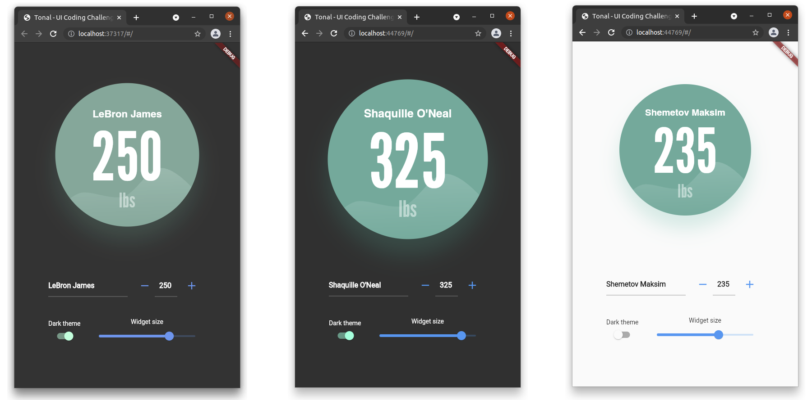
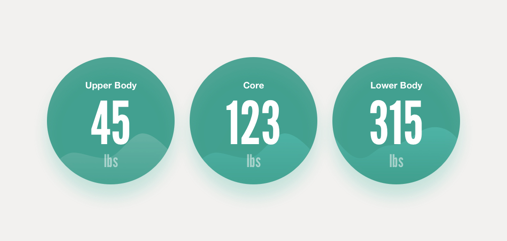

# Tonal - UI Coding Challenge

Modern UI engineering is all about components. When we build components to be reusable, we enable faster iteration and higher consistency across the application and the company.

*Completed assignment - the MetricsWidget preview*

## Requirements

This project is to code a small "metrics" widget that we can reuse across different views. This widget displays a weight and a label. It can be used, for example, in the summary view for a strength assessment.

This widget should be built with Flutter. The widget is comprised of the following pieces:

- Label, STRING (ex: "Upper Body" or "Core")
- Weight, INTEGER (between 0 and 350)
- Unit (always "lbs")
- Background circle with graph

Design example

Regarding fonts, the label is Helvetica. The weight and unit are [League Gothic](https://www.theleagueofmoveabletype.com/league-gothic).

When delivering this widget, please build a screen that demonstrates its use. This screen should also include a form that allows the user to modify the Label and the Weight to see the widget update as changes are made to the form.

## Included Assets

- `design.jpg`: The design as provided by a designer on the team. There are three examples of the widget in this design.
- `graph.svg`: An SVG of the background graph. The design shows different graphs, but for this exercise you can just use this one SVG for all widget instances. You can use the `flutter_svg` package to display the SVG in Flutter: https://pub.dartlang.org/packages/flutter_svg
- `styles.dart`: Some starter styles, exported from the original design.

## Evaluation

We'll be focused on evaluating a few areas:

- Code organization. The widget should be separated from the demo screen. It should be easy to navigate the project.
- Code quality. The code should be understandable and commented when necessary. The widget should be written with the understanding that it will be used in many different places and require additional features in the future.
- Attention to detail. This widget was created by our design team, so they'll be concerned that their design is matched well in the final product. The product team will be concerned that the requirements are implemented as written.